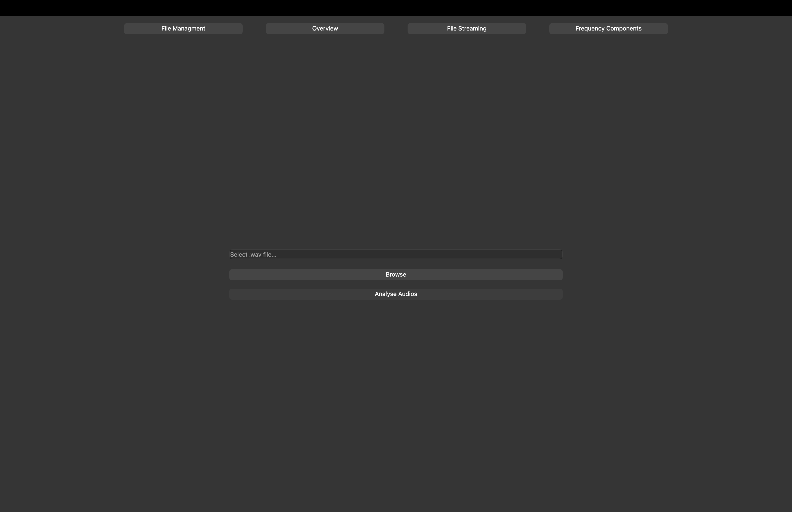
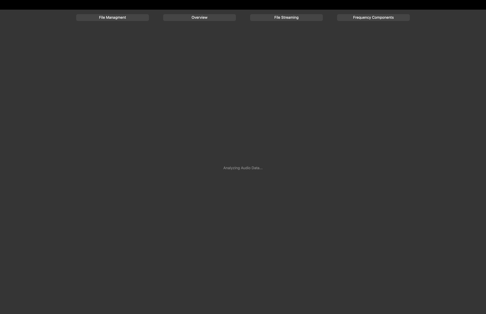
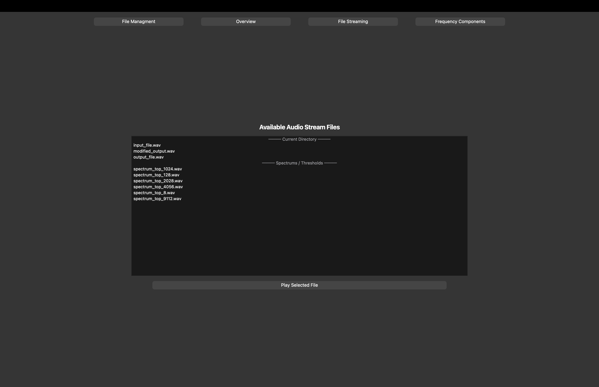
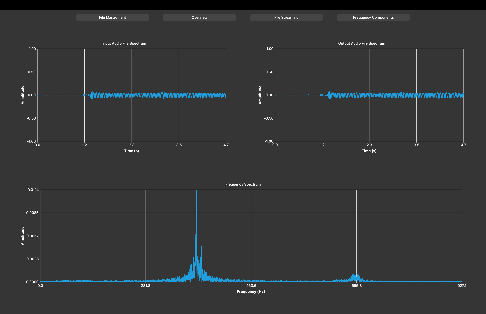
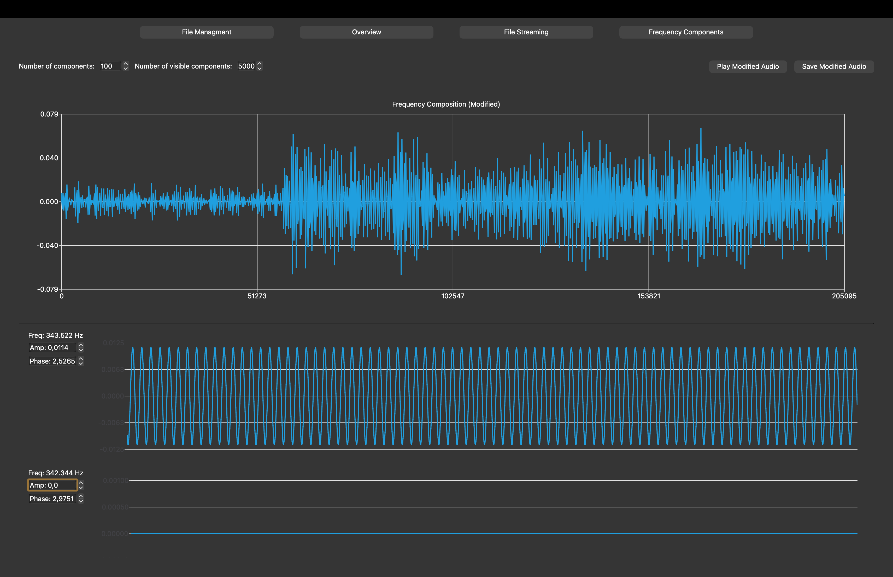

# 🎵 AudioAnalyser

## 💡 Overview

Project focuses on the audio analysis using cpp. It analyzes the .wav audio files and use fast fourier transformation
to distinguish the strongest frequencies from the unused ones.

## ⚙️ Development:

### Commands
```bash
# Initialize build directory
cmake -S . -B build

# Build and run project
cmake --build build --target main && ./build/main

# Build and run tests
cmake --build build --target unit-tests
ctest --test-dir build -R unit-tests -V

# Build and run benchmarks
cmake --build build --target benchmark-tests
ctest --test-dir build -R benchmark-tests -V

# Record your own .wav file (MacOS)
ffmpeg -f avfoundation -thread_queue_size 1024 -i ":1" -ac 1 -ar 44100 -acodec pcm_s16le ./data/eval/input_file.wav

# Build and run documentation
doxygen && open docs/html/index.html

# Set up pre-commit local git hook.
chmod +x .githooks/pre-commit
git config core.hooksPath .githooks
```

### Libraries
Program to work properly needs the instalation of following
dependencies:
- [gtest](https://github.com/google/googletest) - test library.
- [Qt6](https://wiki.qt.io/Building_Qt_6_from_Git?utm_source=chatgpt.com) - gui framework.

### Documentation

Project includes the documentation `.md` files, each
describing other essential aspect of the project, from
the researcher perspective.

- Audio Analysis Techniques: `./docs/AUDIO_ANALYSIS.md`.
- Audio Files Specification: `./docs/AUDIO_FILES.md`.
- Fourier Transform Summarise: `./docs/FFT.md`.


## 📱 App

### Data
After bulding and running the project, based on the `input_file.wav`
in `./data/eval` directory, program will generate several files including
one that is composed of half the sampled frequencies plus one and is called
`./data/eval/output_file.wav`. 

Every other file consisting of the number of
the x most valued frequencies are called: `./data/eval/spectrums/spectrum_to_x.wav`.

### GUI
Application shows various charts representing input and generated
data strength over time graph, as well as graph of strength of each 
frequency, obtained via usage of DFT.

#### File Managment Widget


#### Loading Widget


#### File Streaming Widget


#### Overview Widget


#### Frequency Components Widget


## 🛠 Technologies

<p align="center">
    <a href="https://skillicons.dev">
        
    </a>
</p>
