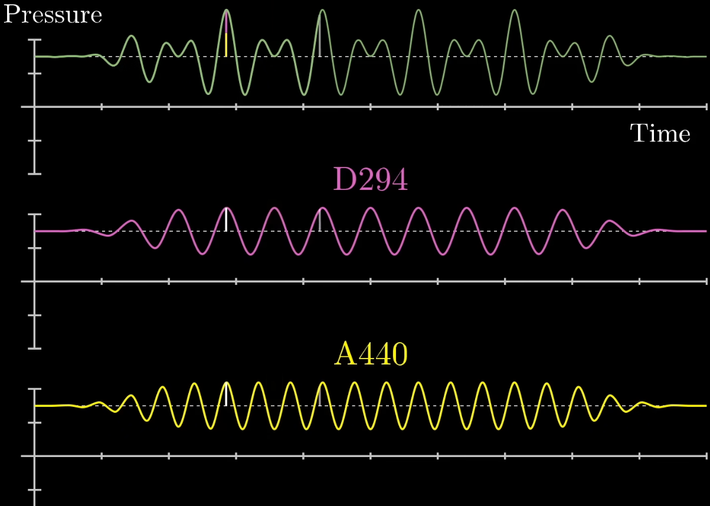

# 📐 Fast Fourier Transform

## 💡 Description

This file summarises the information about Fourier Transform and it's
variants. The goal of the fourier transform in our project is to split
complex sound wave into specific number of individual frequnecies.

## 〰️ Fourier Transform

Fourier Transform converts a time-domain signal into a frequency-domain representation.
It produces a function that takes frequency as input and returns a complex number:

- Re(G(f)) – represents the cosine component (real part).
- Im(G(f)) – represents the sine component (imaginary part).

From this, we can derive:

- |G(f)| – amplitude (strength) of a given frequency
- arg(G(f)) – phase of that frequency

### Formula

The Fourier Transform is given by

$$
\hat{g}(f) = \int_{t_1}^{t_2} g(t) e^{-2\pi i f t} \, dt
$$

Where:

- $ g(t) $ is a wave-like function.
- $ e^{-2\pi i t} $ describes the clockwise movement around a circle.
- $ e^{-2\pi i f t} $ describes the given specific frequencie for
  a rotation.
- We integrate the whole expression to get the position of center of mass
  of such expressed curve.

This formula corresponds to wrapping the graph of the function g(t)
around the unit circle, representing each frequency component as
a complex exponential.

## 🗒️ Sources

- [Fourier Transform](https://www.youtube.com/watch?v=spUNpyF58BY&t=219s)
