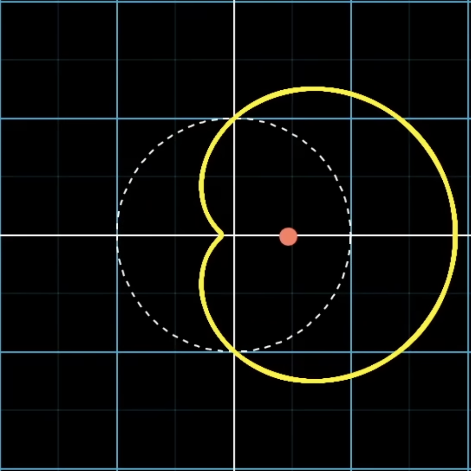
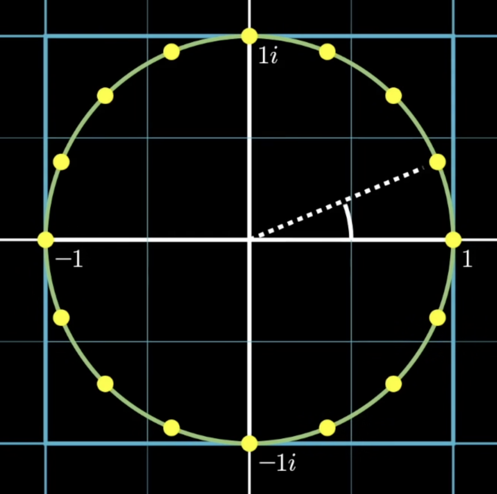
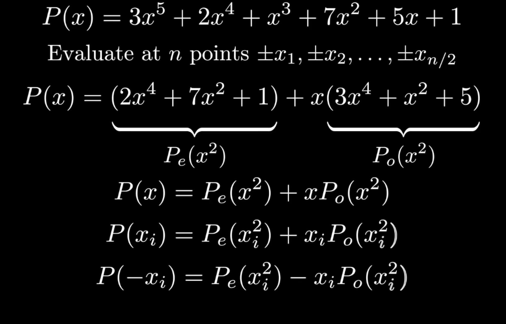

# 📐 Fast Fourier Transform

## 💡 Description

This file summarises the information about Fourier Transform and it's
variants. The goal of the fourier transform in our project is to split
complex sound wave into specific number of individual frequnecies.

## 〰️ Discrete Fourier Transform

### Overview

The foundation of this transform says that to get the information about
the frequencies, that made up the wave, we should wrap the graph of the wave
function around the circle, with some winding frequency (cycles / second).
Then the strength of each frequency in the signal, can be measured, with the
usage of the function, that keeps track of the center of mass of obtained 
shape, by summing all the points in the circular graph and dividing them 
by the number of points. This operation transforms the function of sound 
amplitude over time, into function of amplitude over frequency.

The center of mass of such graph is represented by a complex number. It makes
the calculations easier and it is logical from the mathematical point of view
to represent sth as a complex number, when we touch the topic of rotation.

#### Center of mass position on the winded graph

Complex number representation, allows us to use Euler's formula. This formula
says that, if we take $ e^{i\phi} $, we would land on the point, if we were to
walk $ \phi $ units counterclockwise, starting from point (1, 0) around the 
circle of radius 1.

Winding process is then defined, as a product of wave function g(t) and $ e^{i\phi} $,
which gives us $ g(t)e^{i\phi} $

#### Sound wave function and extracted frequencies functions

### Optimization

Using the Nyquist-Shannon sampling theorem, we can optimize the choice of the number of frequencies for 
reconstructing the signal. This theorem states that a continuous signal can be accurately reconstructed 
from its samples if it is sampled at at least twice the maximum frequency present in the signal.
It means: $ f_s \geq 2 f_\text{max} $.

### Formula

The whole Fourier Transform is given by:

$$
\hat{g}(f) = \int_{t_1}^{t_2} g(t) e^{-2\pi i f t} \, dt
$$

Where:

- $ g(t) $ is a wave-like function.
- $ e^{-2\pi i t} $ describes the clockwise movement around a circle.
- $ e^{-2\pi i f t} $ describes the given specific frequency for
  a rotation.

### Uncertainty Principle

The fact that we deal with waves, means that we are obeyed by wave functions
principles. This includes Haisneberg Uncertainty Principle. In our case it means
the signal concentrated in time must have spread out Fourier Transform and the 
concentrated Fourier Transform must have spread out signal over time.

## Fast Fourier Transform

### Quick Note

We can represent audio data as a polynomial of audio samples in time. In that interpratation to get
the complex number of center of mass of the winded graph of sound function we calculate each term as
a multiplication of n-th coefficient of this polynomial and the n-th root of unity $ e^{\frac{2 \pi i}{n}}$.

#### Roots of unity on complex plane

### Overview

Discrete Fourier Transform unfortunetly has O($ n^2 $) time complexity. For sampling
rate on the level of 44 000 - 48 000 samples per second this algorithm is not the optimal one.
On the countrary James W. Cooley and John W. Tukey in 1965 proposed Fast Fourier Transform
algorithm, that reduces time complexity to O($ n \log{n} $).

They approach this problem from the perspective of multiplying polynomials. Regular multiplication
of coefficient form polynomial takes O($ n^2 $) time, however when we use value form representation
(the one that represents n-th degree polynomial, by n+1 points), the time of multiplication is reduced
to O($ \log{n} $).

The tricky part here is to convert polynomial coefficient form to the value one and the same
operation in reverse. This can be done using the algorithmic strategy "Divide and Conquer",
the proporties of continuous functions and calculations using complex number.

We use the following properties of odd and even polynomials:
- Even degree polynomial: $ P(x) = P(-x) $
- Odd degree polynomial: $ P(-x) = -P(x) $

#### Polynomial grouping

The strategy is to group odd and even terms of polynomial, creating $ P_e(x^2) $ and $ P_o(x^2) $ and odd term polynomials
of $ x^2 $. It is worth to mention that obtained polynomials are of $ \frac{n}{2} - 1$  degreee. We repeat the process of 
evaluation and grouping, until we get the polynomials of degree 0. The fact that we devide the polynomial into two parts 
to the point we get single elements, makes the time complexity of converting coefficient form into value one to be 
$ O(\log{n}) $. 

However to this process to be working we need to consider only complex numbers because the algorithm would not work 
in second iteration. It is that way because we need positive and negative terms and if we would not have complex terms
all coefficients would be positive and algorithm wouldn't work. So we need to use complex numbers and specificly the 
solution for $ x^n = 1 $.

## 🗒️ Sources

- [Discrete Fourier Transform](https://www.youtube.com/watch?v=spUNpyF58BY&t=219s)
- [Fast Fourier Transform](https://www.youtube.com/watch?v=h7apO7q16V0&t=1583s)
- [Uncertainty Principle](https://www.youtube.com/watch?v=MBnnXbOM5S4)

# 📐 Fast Fourier Transform

## 💡 Description

This document summarizes the Fourier Transform and its variants. In this project, the Fourier Transform is used to decompose complex sound waves into their individual frequency components.

## 〰️ Discrete Fourier Transform

### Overview

To analyze the frequencies in a wave, we can conceptually wrap the wave function around a circle with a given winding frequency (cycles per second). The amplitude of each frequency is determined by computing the **center of mass** of this circular graph, summing all points, and dividing by the number of points. This converts a time-domain signal into a frequency-domain representation.

The center of mass is represented as a complex number, which simplifies calculations and naturally represents rotational behavior.

#### Center of mass on the winded graph

Euler's formula allows us to model rotation with complex numbers: \( e^{i\phi} \) represents a point obtained by rotating counterclockwise by \(\phi\) radians from (1, 0) on a unit circle.

The winding operation is defined as multiplying the wave function \( g(t) \) by \( e^{i\phi} \), giving \( g(t)e^{i\phi} \).

#### Sound wave and extracted frequency functions

### Optimization

Using the Nyquist-Shannon sampling theorem, we can choose the optimal number of frequencies to reconstruct a signal. The theorem states that a continuous signal can be perfectly reconstructed if it is sampled at least twice the highest frequency present:

\[
f_s \geq 2 f_\text{max}
\]

### Formula

The Fourier Transform is defined as:

\[
\hat{g}(f) = \int_{t_1}^{t_2} g(t) e^{-2\pi i f t} \, dt
\]

Where:

- \( g(t) \) is the wave function.
- \( e^{-2\pi i t} \) describes clockwise rotation on the circle.
- \( e^{-2\pi i f t} \) corresponds to a specific frequency.

### Uncertainty Principle

The Heisenberg Uncertainty Principle applies to waves: a signal concentrated in time has a spread-out Fourier Transform, while a concentrated Fourier Transform corresponds to a time-spread signal.

## Fast Fourier Transform

### Quick Note

Audio data can be represented as a polynomial of samples over time. Each term is multiplied by the \(n\)-th root of unity \( e^{\frac{2 \pi i}{n}} \) to compute the center of mass of the winded graph.

#### Roots of unity on the complex plane

### Overview

The Discrete Fourier Transform (DFT) has \(O(n^2)\) time complexity, which is inefficient for large sample rates (e.g., 44,000–48,000 Hz). In 1965, **James W. Cooley** and **John W. Tukey** introduced the **Fast Fourier Transform (FFT)**, reducing complexity to \(O(n \log n)\).

FFT uses polynomial multiplication: direct multiplication in coefficient form takes \(O(n^2)\), but using value form representation (evaluating at \(n+1\) points) reduces it to \(O(n \log n)\).

Converting between coefficient and value forms leverages a **Divide and Conquer** strategy, polynomial properties, and complex numbers.

Properties of polynomials:

- Even-degree: \( P(x) = P(-x) \)
- Odd-degree: \( P(-x) = -P(x) \)

#### Polynomial grouping

Odd and even terms are grouped into \( P_e(x^2) \) and \( P_o(x^2) \). These polynomials have degree \( \frac{n}{2} - 1 \). This recursive process continues until degree 0, allowing conversion between coefficient and value forms in \(O(\log n)\) time.

Complex numbers are essential: without them, later iterations would have all positive coefficients, breaking the algorithm. Using complex roots of unity ensures proper cancellation and correct FFT computation.

## 🗒️ Sources

- [Discrete Fourier Transform](https://www.youtube.com/watch?v=spUNpyF58BY&t=219s)
- [Fast Fourier Transform](https://www.youtube.com/watch?v=h7apO7q16V0&t=1583s)
- [Uncertainty Principle](https://www.youtube.com/watch?v=MBnnXbOM5S4)